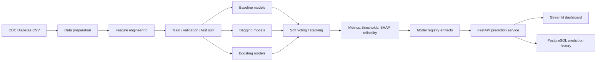

# Diabetes Risk Intelligence

Production-style PoC for diabetes risk scoring with feature engineering, classical ML models, boosting, ensemble learning, calibrated decision thresholds, FastAPI, Streamlit, PostgreSQL, Alembic and Docker Compose.

Dataset: [CDC Diabetes Health Indicators](https://archive.ics.uci.edu/dataset/891/cdc+diabetes+health+indicators)

## Project Idea

The system estimates diabetes risk for a patient profile built from medical, behavioral and socio-demographic indicators. It is designed as a complete ML product flow: dataset preparation, feature engineering, model training, threshold tuning, explainability, API inference, dashboard exploration and prediction logging.



## Dataset Files

Expected full binary dataset:

```text
data/archive/diabetes_binary_health_indicators_BRFSS2015.csv
```

The downloaded archive usually contains three files:

| File | Role |
|---|---|
| `diabetes_binary_health_indicators_BRFSS2015.csv` | Main binary classification dataset used by this project. |
| `diabetes_binary_5050split_health_indicators_BRFSS2015.csv` | Balanced binary variant, useful for sensitivity experiments. |
| `diabetes_012_health_indicators_BRFSS2015.csv` | Multiclass variant, not used in the current binary PoC. |

If the full binary file is available in `data/archive`, the project copies/uses it as the main training source. If it is missing and network access is available, the trainer can fetch the UCI dataset.

## Features

The original dataset contains health indicators such as blood pressure, cholesterol, BMI, smoking, physical activity, fruit/vegetable consumption, general health, mental/physical health days, walking difficulty, age, education and income.

Additional engineered features are created to strengthen the signal:

| Feature group | Examples | Purpose |
|---|---|---|
| Cardiometabolic load | `cardio_metabolic_load`, `HighBP`, `HighChol`, `BMI` | Captures combined metabolic risk rather than isolated indicators only. |
| BMI categories | `bmi_overweight`, `bmi_obese` | Converts raw BMI into clinically interpretable risk bands. |
| Health burden | `general_health_burden`, `mobility_health_burden` | Aggregates self-reported health and mobility limitations. |
| Behavior score | `healthy_behavior_score` | Summarizes activity, fruit and vegetable habits. |
| Interaction features | `age_bmi_interaction` | Captures the fact that BMI risk can behave differently across age groups. |
| Socio-demographic context | age, education, income, healthcare access | Adds broader context around risk and healthcare behavior. |

## Models

| Model | Role |
|---|---|
| Logistic Regression | Interpretable linear baseline. |
| Random Forest | Bagging-based non-linear baseline. |
| Extra Trees | Strong randomized tree ensemble. |
| HistGradientBoosting | Native scikit-learn boosting model. |
| LightGBM | Gradient boosting model for tabular data. |
| XGBoost | Main boosted tree model selected as default. |
| Soft Voting | Probability-level ensemble. |
| Stacking | Meta-model ensemble over base learners. |

## Current Results

Latest full run on the CDC Diabetes Health Indicators dataset produced the following test metrics:

| Model | ROC-AUC | PR-AUC | F1 | Precision | Recall | Balanced accuracy | Threshold |
|---|---:|---:|---:|---:|---:|---:|---:|
| XGBoost | 0.8271 | 0.4225 | 0.4679 | 0.3813 | 0.6053 | 0.7231 | 0.235 |
| HistGradientBoosting | 0.8263 | 0.4216 | 0.4663 | 0.3758 | 0.6142 | 0.7245 | 0.230 |
| Soft Voting | 0.8262 | 0.4206 | 0.4653 | 0.3811 | 0.5974 | 0.7202 | 0.550 |
| LightGBM | 0.8258 | 0.4204 | 0.4654 | 0.3843 | 0.5898 | 0.7184 | 0.660 |
| Stacking | 0.8262 | 0.4202 | 0.4668 | 0.3855 | 0.5915 | 0.7194 | 0.690 |
| Random Forest | 0.8230 | 0.4139 | 0.4613 | 0.3678 | 0.6185 | 0.7232 | 0.575 |
| Extra Trees | 0.8219 | 0.4117 | 0.4588 | 0.3686 | 0.6076 | 0.7195 | 0.610 |
| Logistic Regression | 0.8209 | 0.3991 | 0.4588 | 0.3734 | 0.5949 | 0.7166 | 0.640 |

XGBoost is currently the default model because it achieved the best test PR-AUC and the best overall ranking quality. HistGradientBoosting is extremely close and has slightly higher recall/balanced accuracy, which is useful for discussing the precision-recall tradeoff in the report.

## Decision Thresholds

The project does not use a fixed `0.5` threshold. Instead, thresholds are tuned on validation data and exposed as operating modes:

| Mode | Threshold | F1 | Precision | Recall | Balanced accuracy |
|---|---:|---:|---:|---:|---:|
| Balanced F1 | 0.235 | 0.4725 | 0.3857 | 0.6096 | 0.7262 |
| High Recall | 0.135 | 0.4399 | 0.3033 | 0.8004 | 0.7514 |

Balanced F1 is the default decision mode for a stable precision-recall balance. High Recall is useful when missing potentially risky cases is more expensive than producing additional false positives.

## Visual Diagnostics

Model comparison and diagnostics are saved under `artifacts/reports`.

ROC curve:


Precision-Recall curve:


Reliability curve:


Feature importance:


SHAP summary:


## Dashboard

| Tab | Purpose |
|---|---|
| Predict | Enter patient profile, select model and operating mode, then receive risk probability and risk label. |
| Model Lab | Compare trained models, inspect metrics and diagnostic plots. |
| Dataset | Preview dataset rows, target distribution and numeric feature summaries. |
| History | Review prediction requests saved to PostgreSQL. |

Main UI:

```text
http://localhost:8510
```

API docs:

```text
http://localhost:8010/docs
```

## Artifacts

Training writes outputs to:

```text
artifacts/models/
artifacts/reports/
```

Important files:

| Artifact | Description |
|---|---|
| `artifacts/manifest.json` | Dataset metadata, model registry and default model. |
| `artifacts/reports/model_comparison.csv` | Main model comparison table. |
| `artifacts/reports/metrics_<model>.json` | Validation/test metrics and threshold policies. |
| `artifacts/reports/error_slices_<model>.csv` | Error analysis by age, BMI, blood pressure, cholesterol and income slices. |
| `artifacts/reports/roc_curve_<model>_test.png` | ROC curve on test data. |
| `artifacts/reports/pr_curve_<model>_test.png` | Precision-Recall curve on test data. |
| `artifacts/reports/reliability_<model>_test.png` | Calibration/reliability curve. |
| `artifacts/reports/feature_importance_<model>.png` | Feature importance plot. |
| `artifacts/reports/shap_summary_<model>.png` | SHAP explainability plot. |

## Local Run

```bash
make setup
make full
make api
make ui
```

Fast development mode:

```bash
make fast
```

Partial reruns:

```bash
make train MODEL=xgboost
make train-no-explain MODEL=xgboost
make finalize
```

## Docker Run

```bash
make train-full-docker
make up
```

Fast Docker training:

```bash
make train-fast-docker
make up
```

Default host ports in the current `.env`:

```text
API: http://localhost:8010
UI: http://localhost:8510
PostgreSQL host port: 5432
```

## Useful Commands

| Command | Description |
|---|---|
| `make prepare` | Prepare dataset only. |
| `make fast` | Faster development training mode. |
| `make full` | Complete report-grade training mode. |
| `make train MODEL=xgboost` | Train one selected model. |
| `make train-no-explain MODEL=xgboost` | Train selected model without expensive explainability/ensemble steps. |
| `make finalize` | Rebuild manifest and comparison from existing metrics. |
| `make up` | Build and run Docker stack. |
| `make logs` | Follow Docker logs. |
| `make down` | Stop containers. |

## API Endpoints

| Endpoint | Description |
|---|---|
| `GET /health` | Process liveness. |
| `GET /ready` | Database and model registry readiness. |
| `POST /predict` | Generate risk prediction and log request. |
| `GET /history` | Latest prediction logs. |
| `GET /model/comparison` | Model comparison table. |
| `GET /model/metrics/{model_name}` | Metrics for one model. |
| `GET /dataset/preview` | Dataset preview. |
| `GET /artifacts/manifest` | Model registry metadata. |

## Notes

This project is a PoC and should not be interpreted as a medical diagnostic system. It demonstrates a reproducible ML workflow, risk scoring interface, model diagnostics and deployment structure. Production use would require external validation, clinical review, privacy controls, monitoring and governance.
